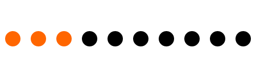
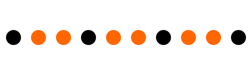
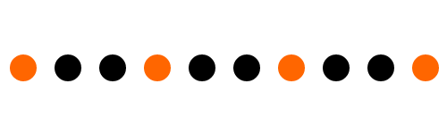
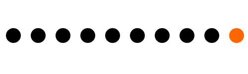

nth-child是针对一个列表的选项进行针对性的操作，其系列可供在我们各种情况下使用

- :first-child
- :first-of-type
- :last-of-type
- :only-of-type
- :only-child 
- :nth-child(n) 
- :nth-last-child(n)
- :nth-of-type(n)
- :nth-last-of-type(n)
- :nth-last-of-type(n)

**具体可查询  [css 选择器参考手册](http://www.w3school.com.cn/cssref/css_selectors.asp)*

### 构建DOM结构

``` html
<!DOCTYPE html>
<html lang="zh">
<head>
    <meta charset="UTF-8">
    <title>nth-child</title>
    <style>
    	ul.list {width: 500px;margin: 100px auto;}
    	ul.list li {width: 30px;height: 30px;border-radius: 50%;overflow: hidden;
    	text-indent: -9999px;background: #f60;float: left;margin: 0 10px;}
    </style>
</head>
<body>
    <ul class="list">
        <li>这是列表第1行</li>
        <li>这是列表第2行</li>
        <li>这是列表第3行</li>
        <li>这是列表第4行</li>
        <li>这是列表第5行</li>
        <li>这是列表第6行</li>
        <li>这是列表第7行</li>
        <li>这是列表第8行</li>
        <li>这是列表第9行</li>
        <li>这是列表第10行</li>
    </ul>
</body>
</html>
```

> 选择器中出现的数字 和数组不同。1就是代表第一位,以此类推

#### 选择前三个


```
ul.list li:nth-child(-n+3){background: #000;}
```

#### 选择从第四个到最后



```
ul.list li:nth-child(n+4){background: #000;}
```

#### 选择从第四个到第八个


```
ul.list li:nth-child(n+4):nth-child(-n+8){background: #000;}
```

#### 选择奇数行


```
ul.list li:nth-child(2n+1){background: #000;}
或者
ul.list li:nth-child(odd){background: #000;}
```

#### 选择偶数行


```
ul.list li:nth-child(2n){background: #000;}
或者
ul.list li:nth-child(even){background: #000;}
```

#### 选择3/6/9等三倍数行


```
ul.list li:nth-child(3n){background: #000;}
```

#### 选择2/5/8等三倍数行


```
ul.list li:nth-child(3n+2){background: #000;}
```

#### 选择1/4/7/10等三倍数行



```
ul.list li:nth-child(3n+1){background: #000;}
```

#### 选择1/4/7/10等五倍数行


```
ul.list li:nth-child(5n){background: #000;}
```

### 来点高级的

#### 选择第三个到第九个之间的奇数行(不包括3/9)

")

```
ul.list li:nth-child(2n+1):nth-child(n+4):nth-child(-n+8){background: #000;}
```

#### 选择第三个到第九个之间的奇数行(包括3/9)

")

```
ul.list li:nth-child(2n+1):nth-child(n+3):nth-child(-n+9){background: #000;}
```

#### 选择3位倍数+1的(1/4/7/10),其中的偶数

,其中的偶数")

```
ul.list li:nth-child(3n+1):nth-child(2n){background: #000;}
```

### 此类选择器扩展

#### 在不知道一共有多少个的情况下,如何选择最后两个


```
ul.list li:nth-last-child(-n+2){background: #000;}
```

#### 引入新选择器实现反选 :not(),举例:选择除了1/4/7/10 等三位倍数的其他选项



```
ul.list li:not(:nth-child(3n+1)){background: #000;}
```

#### 用反选选择除去最后一个的所有选项



```
ul.list li:not(:nth-last-child(1)){background: #000;}
或者
ul.list li:not(:last-child){background: #000;}
```

FungLeo原创,转发请保留版权申明以及首发地址:[原文链接](http://blog.csdn.net/FungLeo/article/details/50813881)

