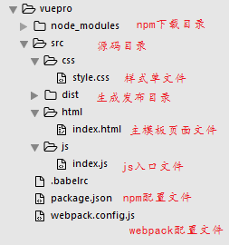

用自动化构建方式commenjs规范写vuejs

### 首先创建合理的项目开发目录结构



#### 初始化 `package.json` 文件和创建 `.babelrc` 编译es2015语法文件，以及npm 安装vue相关插件
```
	npm install vue webpack babel-cli babel-loader babel-preset-es2015 html-webpack-plugin --save-dev
```
先装这些，以后继续添加，webpack 不建议全局安装，版本更新问题

```
{
  "name": "vuepro",
  "version": "1.0.0",
  "description": "",
  "main": "index.js",
  "scripts": {
    "build": "webpack",
    "dev": "webpack-dev-server --inline --hot --content-base ./src/dist"
  },
  "author": "hao",
  "license": "ISC",
  "devDependencies": {
    "babel-cli": "^6.22.2",
    "babel-loader": "^6.2.10",
    "babel-preset-es2015": "^6.22.0",
    "babel-preset-stage-2": "^6.22.0",
    "css-loader": "^0.26.1",
    "element-ui": "^1.1.6",
    "file-loader": "^0.10.0",
    "html-webpack-plugin": "^2.26.0",
    "style-loader": "^0.13.1",
    "vue": "^2.1.10",
    "vue-loader": "^10.1.2",
    "vue-resource": "^1.1.1",
    "vue-router": "^2.2.0",
    "vue-template-compiler": "^2.1.10",
    "vuex": "^2.1.1",
    "webpack": "^1.14.0",
    "webpack-dev-server": "^1.16.2"
  }
}

//这仅仅是 package.json 样例
```
```
var HtmlWebpackPlugin = require("html-webpack-plugin");		//加载插件
var webpack = require("webpack");			//加载webpack

module.exports = {
    entry:{			
       // "index":__dirname+"/src/js/index.js"			//设置入口js文件
        "index":[__dirname+"/src/js/index.js",			//热加载配置
        "webpack-dev-server/client?http://127.0.0.1:8080"]
    },
    output:{
        publicPath:"http://127.0.0.1:8080/",		
        path:__dirname+"/src/dist/js",		//输出文件路径
        filename:"[name].js"			//输出的文件最终以入口文件的名称
    },
    resolve:{				//设置vue自动
        alias:{
            vue:"vue/dist/vue.js"
        }
    },
    module:{
        loaders:[
            {test: /\.css$/,loader:'style!css'},			//设置渲染css
            {test: /\.(png|jpe?g|gif|svg)(\?\S*)?$/,loader: 'file',query: {name: '[name].[ext]?[hash]'}},		//图片渲染
            {test:/\.js$/,loader:"babel",query:{compact:true}},			//es2015语法 babel转化
            {test:/\.vue$/,loader:"babel!vue", exclude:"/node_modules/"},
            {test:/\.(eot|woff|woff2|svg|ttf)([\?]?.*)$/,loader:"file" }

        ]
    },
    plugins:[
        new HtmlWebpackPlugin({
            //filename:__dirname+"/src/dist/index.html",		//目标文件
            filename:"index.html",	
            template:__dirname+"/src/html/index.html",			//自动生成html文件
            inject:"body",			//js注入位置
            hash:true,				//注入js增加随机hash 
            chunks:["index"] 		//注入哪一个js文件
        })
    ]
}

//这仅仅是 webpack.config.js配置文件 样例
```
```
{
    "presets":["es2015"]
}

// .babelrc 是固定文件名，设置es2015编译语法的配置文件
```

### 接下来就可以开始正式写页面代码了

#### 在 `src/js/index.js` 里面写页面主逻辑,在`src/html/index.html` 里面写页面代码

```
import Vue from "vue";			//首先导入vue

new Vue({
    el:"#app",
    data:{
       name:"hao"
    }
})

```
