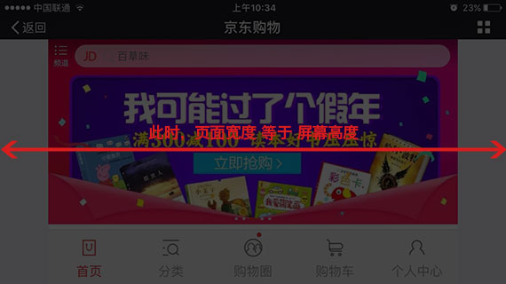

在移动端，判断横竖屏的场景并不少见，比如根据横竖屏以不同的样式来适配，抑或是提醒用户切换为竖屏以保持良好的用户体验。

### CSS Media Queries

通过媒体查询的方式，我们可以通过以下方法来实现根据横竖屏不同的情况来适配样式：

1.内联样式

```
@media screen and (orientation:portrait) {
    /*竖屏*/
}
@media screen and (orientation:landscape) {
    /*横屏*/
}
```
2.外联样式

```
<!-- 竖屏 -->
<link rel="stylesheet" media="all and (orientation:portrait)" href="..." />
<!-- 横屏 -->
<link rel="stylesheet" media="all and (orientation:landscape)" href="..." />
```

### window.matchMedia()

除此之外，CSS Object Model（CSSOM）Views 规范增加了对 JavaScript 操作 CSS Media Queries 的原生支持，它在 window 对象下增加了 matchMedia() 方法，让我们能够通过脚本的方式来实现媒体查询。

window.matchMedia() 方法接受一个 Media Queries 语句的字符串作为参数，返回一个 MediaQueryList 对象。该对象有 media 和 matches 两个属性：

- media：返回所查询的 Media Queries 语句字符串
- matches：返回一个布尔值，表示当前环境是否匹配查询语句

同时，它还包含了两个方法，用来监听事件：

- addListener(callback)：绑定回调 callback 函数
- removeListener(callback)：注销回调 callback 函数

那么，通过 window.matchMedia() 的方法，我们可以这样判断横竖屏：

```
var mql = window.matchMedia("(orientation: portrait)");
function onMatchMeidaChange(mql){
    if(mql.matches) {
        // 竖屏
    }else {
        // 横屏
    }
}
onMatchMeidaChange(mql);
mql.addListener(onMatchMeidaChange);
```
### window.innerHeight/window.innerWidth

> The ‘orientation’ media feature is ‘portrait’ when the value of the ‘height’ media feature is greater than or equal to the value of the ‘width’ media feature. Otherwise ‘orientation’ is ‘landscape’.
—— CSS/Mediaqueries/orientation

在 CSS Media Queries 中，Orientation 属性有两个值：

- portrait，指的是当 height 大于等于 width 的情况 （即竖屏）
- landscape，指的是当 height 小于 width 的情况 （即横屏）

所以，还有一种最为常见的方法是通过比较页面的宽高，当页面的高大于等于宽时则认为是竖屏，反之则为横屏。

```
function detectOrient(){
    if(window.innerHeight >= window.innerWidth) {
        // 竖屏
    }else {
        // 横屏 
    }
}
detectOrient();
window.addEventListener('resize',detectOrient);
```

### window.orientation

在 iOS 平台以及大部分 Android 手机都有支持 window.orientation 这个属性，它返回一个与默认屏幕方向偏离的角度值：

- 0：代表此时是默认屏幕方向
- 90：代表顺时针偏离默认屏幕方向90度
- -90：代表逆时针偏离默认屏幕方向90度
- 180：代表偏离默认屏幕方向180度

在实际应用中，对于 iPhone 和大部分 Android 是没有180度的手机竖屏翻转的情况的，但是 iPad 是存在的。所以，简化下代码，我们可以绑定orientationchange事件来判断横竖屏：

```
function detectOrient(){
    if (Math.abs(window.orientation) === 90) {
        // 横屏
    } else {
        // 竖屏
    }
}
detectOrient();
window.addEventListener('orientationchange',detectOrient);
```

### 影响判断的问题所在

#### 1.对window.orientation属性值的不一致

在 iOS 平台，对 window.orientation 属性值是无异议的，规范当中有明确规定每个值对应的情况。但是对于 Android 平台，就有不一致的特殊情况出现。针对这种不一致情况的出现，对于追求完美的开发者来说，通过 window.orientation 的方法来判断横竖屏则变得有点不可靠的。

#### 2.软键盘的弹出

是否除了 window.orientation 的其它方法都是可靠的呢？
然而，实际上是事与愿违的。在 Android 下，如果页面中出现软键盘弹出的情况（存在有 Input 的元素）时，页面有时会因为软键盘的弹出而导致页面回缩，即页面的宽度（竖屏时）或者高度（横屏时）被改变。
无论是 CSS Media Queries 还是 window.matchMedia() 方法，还是根据 window.innerWidth、window.innerHeight的页面宽高比对方法来实现的横竖屏判断方法，都会因此受到影响，出现判断失误的情况（ Samsung SCH-i699 机型，在竖屏时由于软键盘弹出导致页面高度小于宽度，被错误地判定为横屏）。
所以，在这样的情况下，这几种方式也变得不可靠。

### 探讨最佳实现方式

如果你没有遇上以上两个问题所在，恭喜你！上面所提到的方法都可以被应用，选择你最为喜欢的方法就好。

经过实际情况的研究，针对开发环境兼容的情况（ iOS 与 Android 下的微信内置浏览器与原生浏览器）来说，屏幕分辨率是不会改变的，那么我们可以尝试比对页面宽高和屏幕分辨率来判断横竖屏。

- 若获取 当前页面的宽（document.documentElement.clientWidth），等于屏幕分辨率的宽(screen.width)，则可认定当前属于竖屏。


- 若获取 当前页面的宽（document.documentElement.clientWidth），等于屏幕分辨率的高(screen.height)，则可认定当前属于横屏。



（图为以 iPhone 6s 横屏下的微信内置浏览器为例的截图）

如此，对应的代码为：

```
// 判断横竖屏
var utils = {
    debounce: function(func,delay){
        var timer = null;
        return function(){
            var context = this,
                args = arguments;
            clearTimeout(timer);
            timer = setTimeout(function(){
                func.apply(context,args);
            },delay);
        }
    }
}

function detectOrient() {
    var storage = localStorage; // 不一定要使用localStorage，其他存储数据的手段都可以
    var data = storage.getItem('J-recordOrientX');
    var cw = document.documentElement.clientWidth;
    var _Width = 0,
        _Height = 0;
    if(!data) {
        sw = window.screen.width;
        sh = window.screen.height;
        // 2.在某些机型（如华为P9）下出现 srceen.width/height 值交换，所以进行大小值比较判断
        _Width = sw < sh ? sw : sh;
        _Height = sw >= sh ? sw : sh;
        storage.setItem('J-recordOrientX',_Width + ',' + _Height);
    }else {
        var str = data.split(',');
        _Width = str[0];
        _Height = str[1];
    }
    if(cw == _Width) {
        // 竖屏
        return;
    }
    if(cw == _Height){
        // 横屏
        return;
    }
}
// 3.函数去抖处理
window.onresize = utils.debounce(detectOrient,300);
detectOrient();
```

[原文链接](http://jdc.jd.com/archives/3862)
